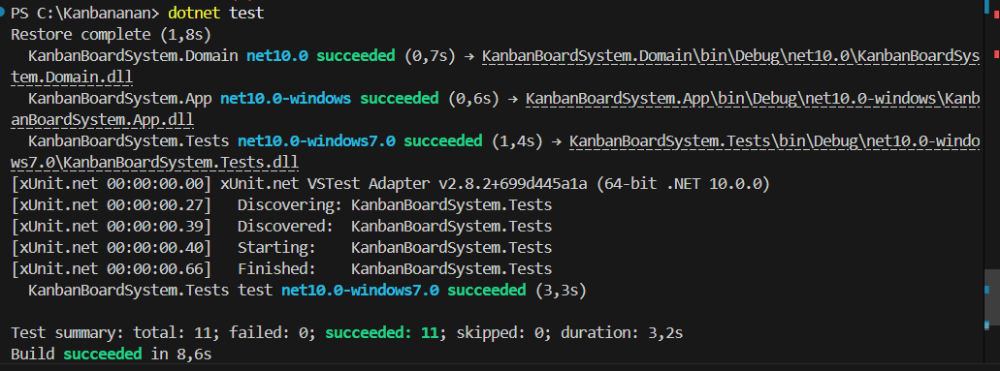
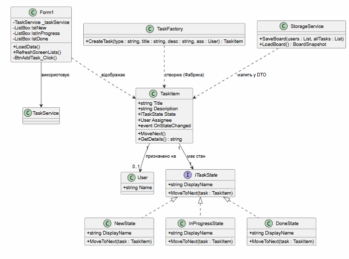

#  Kanban Board System (.NET 10)

Проста та гнучка система керування завданнями типу "Канбан-дошка", реалізована на платформі **.NET 10** із використанням архітектурних паттернів та принципів **SOLID**.

##  Організація проєкту

Проєкт розділений на три логічні блоки (багатопроєктна архітектура):
1. **KanbanBoardSystem.Domain** — ядро системи. Містить бізнес-логіку, моделі даних (`TaskItem`, `User`), патерни станів та сервіси.
2. **KanbanBoardSystem.App** — графічний інтерфейс користувача (UI) на Windows Forms для зручної візуалізації дошки.
3. **KanbanBoardSystem.Tests** — проєкт автоматичного юніт-тестування на базі фреймворку **xUnit**.


## 🛠️ Які технології та фічі реалізовано:

* **Інкапсуляція та об'єкти:** Приватні поля, безпечний доступ через публічні властивості `{ get; set; }` та перевизначені базові методи (`ToString`, `Equals`).
* **Поліморфізм та Наслідування:** Базовий клас завдань розширено під конкретні типи: звичайні задачі (`Task`), баги (`Bug`) та нові фічі (`Feature`) з власним форматом виведення даних.
* **Узагальнення (Generics):** Створено універсальний репозиторій `Repository<T>` для роботи з колекціями без дублювання коду.
* **LINQ & Делегати:** Швидка фільтрація задач за колонками, групування (`GroupBy`) та підрахунок статистики «на льоту» через лямбда-вирази `=>`.
* **Патерни проєктування:** * `State` (Стан) — для контролю за рухом картки по колонках (*Нова -> В процесі -> Виконано*).
  * `Factory` (Фабрика) — для зручної генерації різних типів завдань.
  * `Observer` (Спостерігач) — через події (`OnStateChanged`) для миттєвого оновлення інтерфейсу.
* **Серіалізація:** Автоматичне збереження стану дошки у файл `tasks.json` та його зчитування за допомогою `System.Text.Json`.
* **Обробка помилок:** Контроль за винятками (`try-catch`), власні типи помилок (`TaskValidationException`) та логіка повторних спроб (`Retry`) при збоях доступу до файлу.


##  Юніт-тестування

Критична логіка покрита **10 автоматичними тестами** на xUnit з використанням ізоляції залежностей (Moq). Тести перевіряють:
* Створення об'єктів та роботу перевантажених конструкторів.
* Коректність переходу між станами задачі.
* Блокування дій (викидання `InvalidOperationException`) при спробі посунути вже виконану задачу.
* Правильність роботи методів порівняння об'єктів.



##  Як запустити проєкт

1. Переконайся, що у тебе встановлено **.NET 10 SDK**.
2. Запусти програму через консоль з кореневої папки:
   ```bash
   dotnet run --project KanbanBoardSystem.App

## Діаграма
